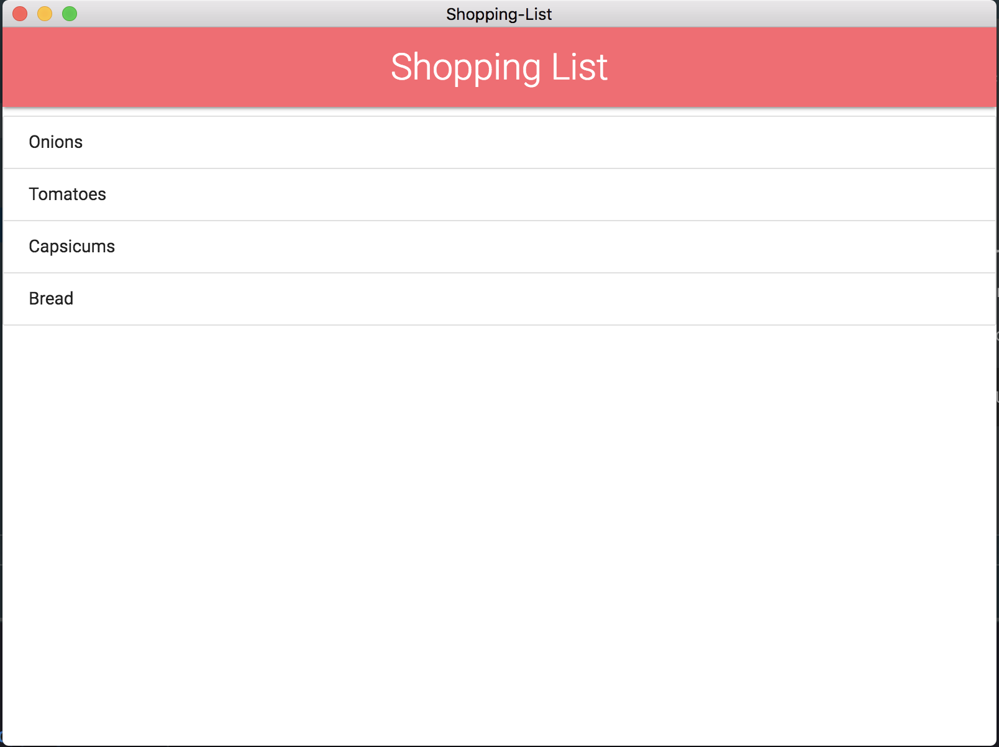
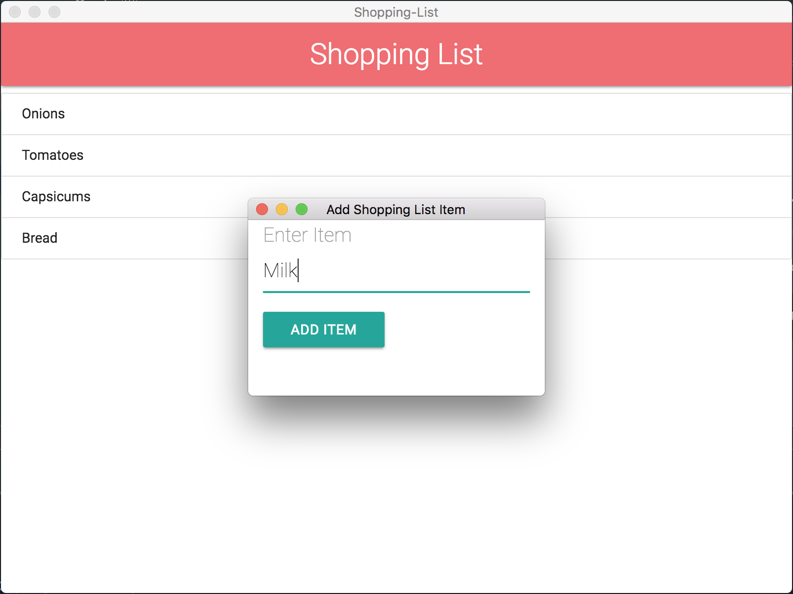
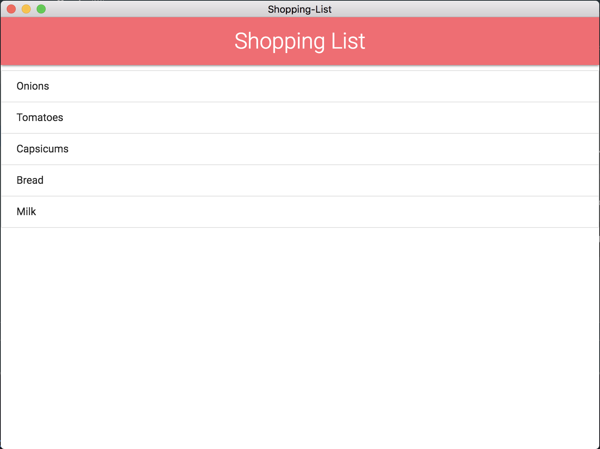

# Shopping List App #

#### A desktop app based on Electron ####

A simple shopping list app that is based on the electron platform for mac, windows and linux. It is styled using materialize.

#### Project ScreenShots

<p align="center">

<br/>
Main Screen with List
</p>
<br/><br/>
<p align="center">

<br/>
Add Item screen
</p>
<br/><br/>
<p align="center">

<br/>
Main Screen after items added
</p>
<br/>
<br/>

#### App ShortCuts

1.Cmd/Ctrl + A: For opening item add screen

2.Cmd/Ctrl + S: Clear the shopping list

3.Cmd/Ctrl + I: Toggle developer options (*Only in developer mode)

4.Cmd/Ctrl + Q: Quiting the app

5.Double Click on app item to delete it from the shopping list

##### For switching to developer mode

In main.js
change this:

```javascript
process.env.NODE_ENV = 'production';
```

to:

```javascript
process.env.NODE_ENV = 'development';
```


#### Steps to run project ####

Make sure npm and nodejs are installed on your machine.

Clone the repository on your local machine and run.

```npm
npm install --dev
```

##### Running the project

Run script

```npm
npm start
```

#####Package project

For Windows

```npm
npm run package-win
```

For Mac

```npm
npm run package-mac
```

For Windows

```npm
npm run package-linux
```

The file will be found in release-builds

#### License
 
The MIT License (MIT)

Copyright (c) 2015 Chris Kibble

Permission is hereby granted, free of charge, to any person obtaining a copy of this software and associated documentation files (the "Software"), to deal in the Software without restriction, including without limitation the rights to use, copy, modify, merge, publish, distribute, sublicense, and/or sell copies of the Software, and to permit persons to whom the Software is furnished to do so, subject to the following conditions:

The above copyright notice and this permission notice shall be included in all copies or substantial portions of the Software.

THE SOFTWARE IS PROVIDED "AS IS", WITHOUT WARRANTY OF ANY KIND, EXPRESS OR IMPLIED, INCLUDING BUT NOT LIMITED TO THE WARRANTIES OF MERCHANTABILITY, FITNESS FOR A PARTICULAR PURPOSE AND NONINFRINGEMENT. IN NO EVENT SHALL THE AUTHORS OR COPYRIGHT HOLDERS BE LIABLE FOR ANY CLAIM, DAMAGES OR OTHER LIABILITY, WHETHER IN AN ACTION OF CONTRACT, TORT OR OTHERWISE, ARISING FROM, OUT OF OR IN CONNECTION WITH THE SOFTWARE OR THE USE OR OTHER DEALINGS IN THE SOFTWARE.